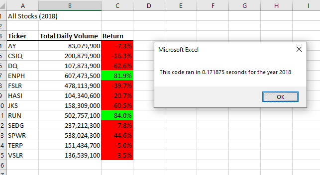
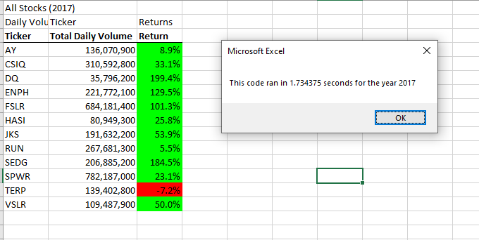

# VBA Green Stock Analysis

## Overview of Project

This projects main goal was to give Steve parnets a robust analysis of  DAQO new enegry Corperation, along with several other companies who also deal in with green energy. The task was to create several variations code who all take the information given and provide feedback on it to determine how profitable each stock would be, and to give Steve the informatio needed to give the best suggestion to his parnets about how best to diversify the stock portfolio as well as their initial investment of DAQO.

## Results

From the inital results gained we can clearly see which stocks are the most profitable, and now Steve can clearly explain to his parents which stocks are the most profitable longterm and how best to diversify their protfolio. This has also resulted in a code in which Steve can use in the future whenever he wants to judge any assortment of related stock values, with a macro that is easy to use. 

## Summary 

In closing, from what we can see is that the vast majority of the stocks have fallen significantly over the year. Furthermore only two stocks show any growth, and thus it can be advised that as of the time of this analysis, these "Green Stocks" are not a safe first place of an investment. 

### Advantages of Refactored Code

Refactoring code does allow us to reuse code and add to it. In this such case, the code can easily be altered to add more stocks, and more years with a few simple changes. It is also easy to use for someone who may not be familiar with coding with a quick "read me" added into the code as well as being faster.

### Disadvantages of Refactored Code

The proccess of code refactoring can be very time consuming, instead of making a new code for the data, altering an existing code can be tidious and small errors can cause the whole code to fail. Furthermore there is a upper limit to how much data the code can take, if you want further anayls you would have to greatly alter the code. And finally, the code if altered incorrectly can give incorrect read outs and thus more confusion.
